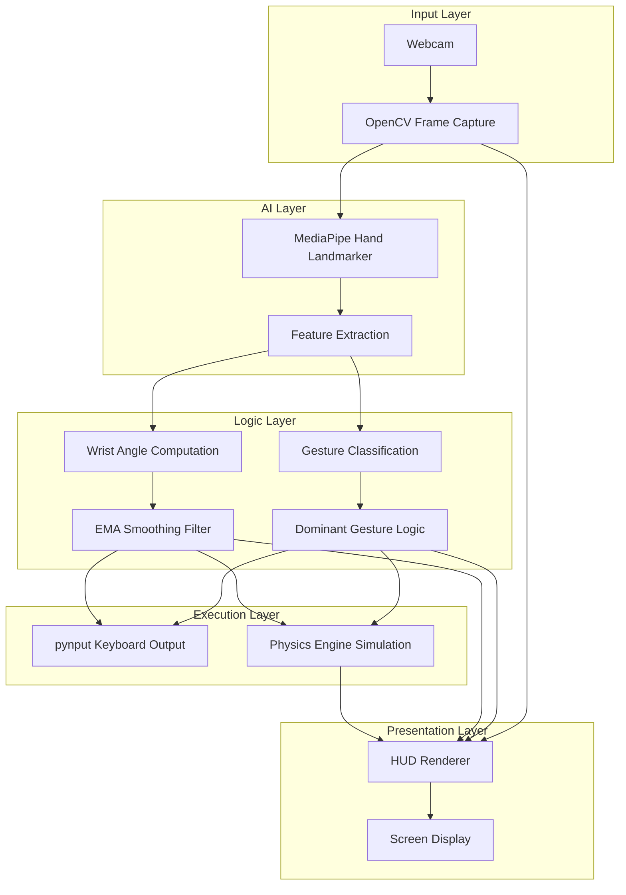
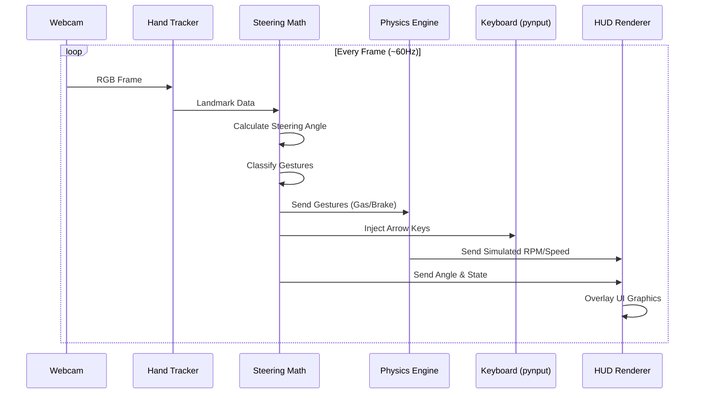

# Virtual Steering

> **Control racing games with your hands using your webcam — no hardware required.**

A production-grade, real-time hand-gesture steering system using **Python + OpenCV + MediaPipe**. Hold an imaginary steering wheel in front of your camera and it maps your hand angles directly to keyboard arrow keys.

---

## How It Works

| Gesture | Action | Key Sent |
|---------|--------|----------|
| Tilt hands **LEFT** | Steer left | `← Arrow` |
| Tilt hands **RIGHT** | Steer right | `→ Arrow` |
| **FIST** (Any hand) | Accelerate | `↑ Arrow` |
| **OPEN** (Any hand) | Brake | `↓ Arrow` |

---

## Features

- **Animated steering wheel** that rotates with your tilt
- **RPM & Speedometer gauges** (arc-style, color-coded)
- **Live telemetry**: angle, speed, RPM, FPS
- **Active key indicators** lighting up in real-time
- **Wrist-to-wrist line** showing the axis being measured

---

## ⚙️ Requirements

- Python **3.10+**
- Webcam (built-in or USB)
- Windows 10/11

---

## Quick Start

### Option 1 — Double-click launcher (easiest)
```
double-click run.bat
```

### Option 2 — Command line
```bash
# 1. Install dependencies
pip install -r requirements.txt

# 2. Run (with keyboard output to games)
python main.py

# 3. Run in visualization-only mode (no keys sent)
python main.py --no-keys

# 4. Use a different camera
python main.py --camera 1
```

---

## Project Structure

```text
virtual steering/
├── main.py              ← Entry point & main loop
├── hand_tracker.py      ← MediaPipe hand detection + gesture classification
├── input_controller.py  ← pynput keyboard injection
├── hud_renderer.py      ← OpenCV HUD: gauges, wheel, telemetry
├── physics_engine.py    ← Simulated speed/RPM/gear telemetry
├── config.py            ← All tunable parameters
├── requirements.txt     ← Python dependencies
└── run.bat              ← Windows one-click launcher
```

---

## 🏗️ System Architecture



---

## 🔄 Data Pipeline



---

## Tuning (`config.py`)

| Parameter | Default | Effect |
|-----------|---------|--------|
| `STEERING_THRESHOLD` | `11°` | How far to tilt before turning |
| `STEERING_DEADZONE` | `4°` | Dead zone around center |
| `SMOOTHING_FACTOR` | `0.25` | Higher = smoother but slower |
| `FIST_CURL_MAX` | `0.65` | Finger curl sensitivity (`hand_tracker.py`) |
| `CAMERA_INDEX` | `0` | Which webcam to use |

---

## Compatible Games

Works with any game that uses **Arrow Keys** for steering:
- CrazyGames (Real Car Driving)
- Chrome Dino game
- Browser-based racing games
- MiniDrivers
- Hill Climb Racing (PC)
- Any game that supports keyboard remapping

---

## Keyboard Shortcuts (in the camera window)

| Key | Action |
|-----|--------|
| `Q` or `ESC` | Quit |
| `R` | Reset physics simulation |

---

## 🛠️ Troubleshooting

| Problem | Fix |
|---------|-----|
| Camera not opening | Try `--camera 1` or `--camera 2` |
| Hands not detected | Improve lighting, show full hands |
| Keys not working in game | Run as Administrator |
| False gestures | Adjust `FIST_CURL_MAX` in `hand_tracker.py` |

---

*Built using Python, OpenCV, and MediaPipe*
